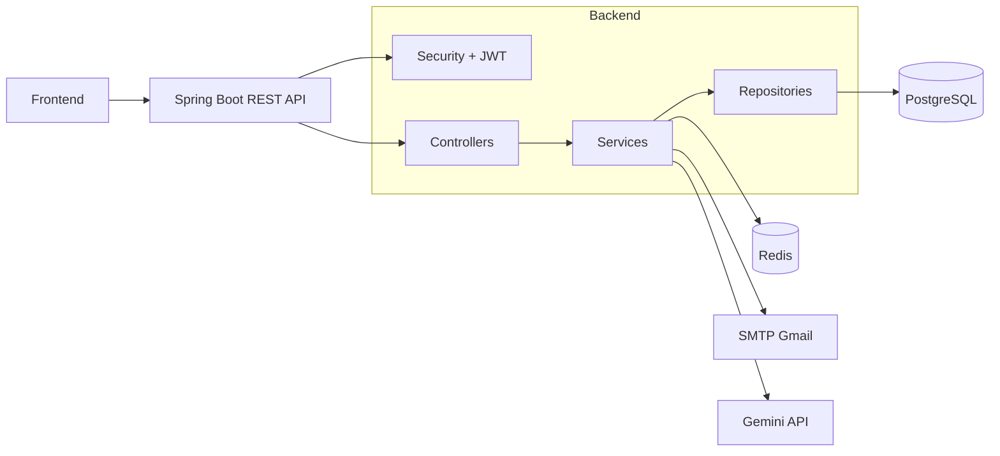
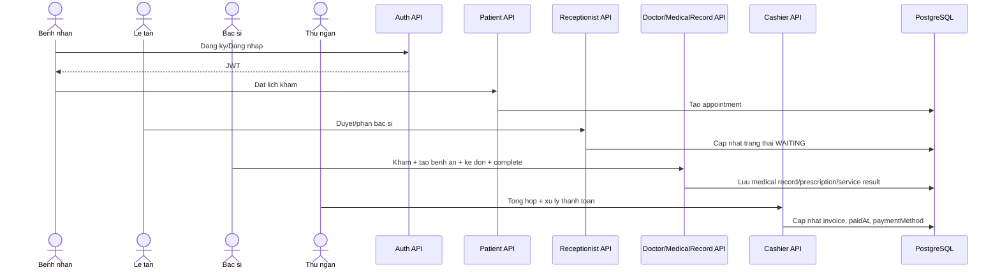

# He thong Quan ly Phong kham - Tong hop chuc nang va luong hoat dong

## 1) Tong quan hien trang

Backend duoc xay dung bang Spring Boot va dang van hanh theo mo hinh JWT stateless voi cac role:

- ADMIN
- RECEPTIONIST
- DOCTOR
- CASHIER
- PATIENT

Nghiep vu dang co:

- Xac thuc tai khoan, refresh token, dang ky benh nhan.
- Quen mat khau OTP qua email, co cooldown/rate-limit tren Redis.
- Benh nhan dat lich, huy lich, xem lich hen va lich su benh an.
- Le tan duyet lich, phan bac si, quan ly waiting queue, huy lich boi phong kham.
- Bac si kham benh, tao benh an, ke don, ghi ket qua dich vu can lam sang, hoan tat benh an.
- Thu ngan tong hop hoa don, xu ly thanh toan, in bien lai, xuat PDF, thong ke giao dich.
- Admin quan tri user, phong kham, thuoc, dich vu, dashboard, bao cao doanh thu.
- Admin quan tri cau hinh he thong key-value (settings).
- Chatbot AI Gemini: hoi dap, luu lich su theo user/patient, xoa lich su.

## 2) Nen tang ky thuat

- Java 17
- Spring Boot 3.5.13
- Spring Data JPA
- Spring Security + JWT
- PostgreSQL
- Redis
- JavaMailSender (SMTP Gmail)
- OpenAPI/Swagger UI
- Apache PDFBox

## 3) Kien truc tong the

He thong theo kien truc phan lop:

- Controller: endpoint REST.
- Service: nghiep vu.
- Repository: truy van CSDL.
- Entity + DTO: model va payload request/response.
- Security/JWT: xac thuc va phan quyen theo role.
- Redis + SMTP: OTP, refresh token, gui mail thong bao.
- Gemini integration: chatbot hoi dap va lich su hoi thoai.

### So do kien truc

## 4) Phan quyen endpoint theo role (SecurityConfig)

- Public:
  - OPTIONS /\*\*
  - /error/\*\*
  - /api/auth/\*\*
  - /api/chatbot/ask
  - /v3/api-docs/\*\*
  - /swagger-ui/\*\*
  - /swagger-ui.html
- Authenticated:
  - /api/chatbot/history/\*\*
- ADMIN:
  - /api/admin/\*\*
- RECEPTIONIST, ADMIN:
  - /api/appointments/\*\*
  - /api/receptionist/\*\*
- DOCTOR, ADMIN:
  - /api/medical-records/\*\*
- CASHIER, ADMIN:
  - /api/invoices/\*\*
- CASHIER:
  - /api/cashier/\*\*
- DOCTOR:
  - /api/doctors/\*\*
- PATIENT:
  - /api/patient/\*\*

## 5) Cac module nghiep vu

### 5.1 Auth va quan ly token

- POST /api/auth/login
- POST /api/auth/register/patient
- POST /api/auth/refresh
- POST /api/auth/logout

Dac diem:

- Access token + refresh token JWT.
- Refresh token luu/rotate qua Redis.

### 5.2 OTP quen mat khau

- POST /api/auth/forgot-password/send-otp
- POST /api/auth/forgot-password/verify-otp
- POST /api/auth/forgot-password/reset

Dac diem:

- OTP co TTL.
- Co cooldown giua 2 lan gui OTP.
- Co gioi han so lan gui va so lan nhap sai.
- Gui OTP qua email SMTP.

### 5.3 Benh nhan

- GET /api/patient/profile
- POST /api/patient/appointments
- GET /api/patient/appointments
- PUT /api/patient/appointments/{appointmentId}/cancel
- GET /api/patient/medical-records
- GET /api/patient/medical-records/{medicalRecordId}

### 5.4 Le tan

- GET /api/receptionist/appointments/today
- GET /api/receptionist/appointments/from-booking
- GET /api/receptionist/doctors/by-specialty
- PUT /api/receptionist/appointments/{appointmentId}/approve
- PUT /api/receptionist/appointments/{appointmentId}/assign-doctor
- GET /api/receptionist/appointments/waiting
- PUT /api/receptionist/appointments/{appointmentId}/waiting-status
- PUT /api/receptionist/appointments/{appointmentId}/cancel

### 5.5 Bac si va benh an

Doctor API:

- GET /api/doctors
- GET /api/doctors/me/waiting-patients
- GET /api/doctors/me/completed-patients
- PUT /api/doctors/{doctorId}/clinic-room
- GET /api/doctors/appointments/{appointmentId}/patient-history
- GET /api/doctors/appointments/{appointmentId}/patient-history/{medicalRecordId}

Medical Record API:

- GET /api/medical-records
- GET /api/medical-records/{id}
- GET /api/medical-records/appointment/{appointmentId}
- POST /api/medical-records
- POST /api/medical-records/doctor
- POST /api/medical-records/{medicalRecordId}/prescription-details
- GET /api/medical-records/{medicalRecordId}/prescription-details
- POST /api/medical-records/{medicalRecordId}/service-results
- GET /api/medical-records/{medicalRecordId}/prescription-workspace
- GET /api/medical-records/{medicalRecordId}/medicine-catalog
- POST /api/medical-records/{medicalRecordId}/prescription-details/quick-add
- PUT /api/medical-records/{medicalRecordId}/prescription-details/{medicineId}
- PUT /api/medical-records/{medicalRecordId}/prescription-details/{medicineId}/autosave
- DELETE /api/medical-records/{medicalRecordId}/prescription-details/{medicineId}
- POST /api/medical-records/{medicalRecordId}/prescription-save
- PUT /api/medical-records/{medicalRecordId}/complete
- PUT /api/medical-records/{id}
- DELETE /api/medical-records/{id}

### 5.6 Thu ngan

- GET /api/cashier/payment-queue
- GET /api/cashier/payment-records/search
- GET /api/cashier/invoices/{invoiceId}/paid-detail
- GET /api/cashier/transaction-history
- GET /api/cashier/invoices/by-medical-record
- POST /api/cashier/invoices/aggregate
- PUT /api/cashier/invoices/{invoiceId}/confirm-payment
- POST /api/cashier/invoices/{invoiceId}/process-payment
- GET /api/cashier/invoices/{invoiceId}/receipt
- POST /api/cashier/invoices/{invoiceId}/print-receipt
- GET /api/cashier/invoices/{invoiceId}/export-pdf

### 5.7 Admin

- GET /api/admin/dashboard
- GET /api/admin/revenue-report
- GET /api/admin/revenue-report/export
- GET /api/admin/users
- POST /api/admin/users
- PUT /api/admin/users/{userId}
- DELETE /api/admin/users/{userId}
- GET /api/admin/rooms
- POST /api/admin/rooms
- PUT /api/admin/rooms/{roomId}
- PUT /api/admin/rooms/{roomId}/assign-doctor
- GET /api/admin/medicines
- POST /api/admin/medicines
- PUT /api/admin/medicines/{medicineId}
- DELETE /api/admin/medicines/{medicineId}
- GET /api/admin/services
- POST /api/admin/services
- PUT /api/admin/services/{serviceId}/price
- DELETE /api/admin/services/{serviceId}
- GET /api/admin/settings
- GET /api/admin/settings/{settingKey}
- PUT /api/admin/settings/{settingKey}

### 5.8 AI Chatbot Gemini

- POST /api/chatbot/ask
- GET /api/chatbot/history
- DELETE /api/chatbot/history

Ghi chu:

- /api/chatbot/ask cho phep guest va user da dang nhap.
- /api/chatbot/history va xoa history yeu cau dang nhap.

## 6) Luong nghiep vu tong quat

## 7) Data va ha tang

- PostgreSQL:
  - Luu user/patient/appointment/medical_record/prescription/invoice/room.
  - Luu chatbot_messages (neu da chay script).
  - Luu system_settings cho cau hinh dong.
- Redis:
  - OTP forgot-password.
  - Metadata cooldown/rate-limit OTP.
  - Refresh token.
- SMTP Gmail:
  - Gui OTP reset password.
  - Gui thong bao lien quan dat lich.

## 8) Cau hinh runtime hien tai (application.properties)

- DB: spring.datasource.url/username/password (co fallback env DB_URL, DB_USERNAME, DB_PASSWORD).
- JPA: spring.jpa.hibernate.ddl-auto=update.
- CORS: app.cors.allowed-origin-patterns.
- Gemini: ai.gemini.\* (model, endpoint, timeout, context/history).
- Mail: spring.mail.\*
- Redis: spring.data.redis.\*
- OTP policy: auth.forgot-password.otp.\*
- JWT policy: auth.jwt.\*
- Logging rolling policy: logging.file._ + logging.logback.rollingpolicy._
- Port: server.port=${PORT:8081}

## 9) Script van hanh

- scripts/start-redis.ps1, scripts/start-redis.cmd
- scripts/stop-redis.ps1, scripts/stop-redis.cmd
- scripts/add-chatbot-history-postgres.sql
- scripts/add-system-settings-postgres.sql
- scripts/migrate-sqlserver-to-postgres.ps1, scripts/migrate-sqlserver-to-postgres.cmd
- scripts/MIGRATE_SQLSERVER_TO_POSTGRES.md
- scripts/check-bom.ps1, scripts/remove-bom.ps1

## 10) Luu y cap nhat tai lieu

- Tai lieu nay da dong bo voi code backend hien tai (cap nhat 2026-04-20).
- Khi thay doi endpoint, role mapping, script migration, hoac policy security/cau hinh, can cap nhat lai tai lieu ngay.
